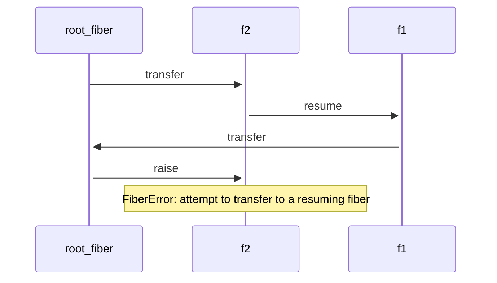
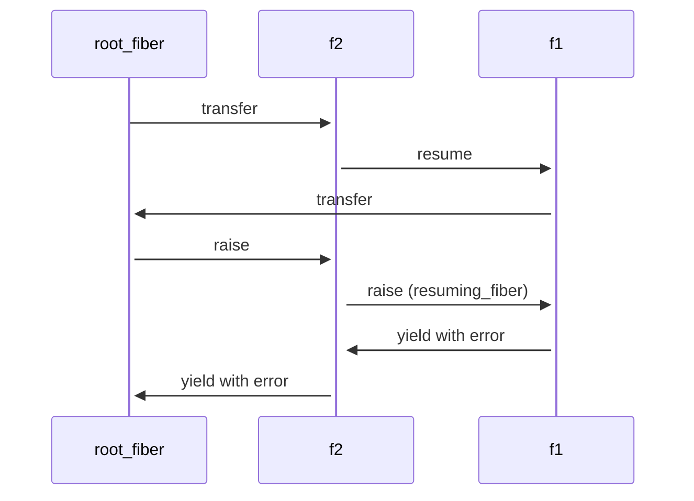

# DevMeeting-2024-04-17

https://bugs.ruby-lang.org/issues/20336

## DateTime and location

* 2024/04/17 (Wed) 13:00-17:00 JST @ Online

## Next Date


* 2024/05/14 (Tue) 14:00-16:00 JST @ Okinawa (in person)
* 2024/06/13 (Thu) 13:00-17:00 JST @ Online

## Announce

### About release timeframe

## Check security tickets

[secret]

## Ordinary tickets
### [[Feature #20300]](https://bugs.ruby-lang.org/issues/20300) Hash: set value and get pre-existing value in one call (eregon)

* It seems generally useful (see latest comments there).
* It is necessary for #20301 (as long as `Set` is implemented in Ruby, and I think it should).

Discussion:

* shyouhei: I said `Set#add?` is weak for this proposal, not against it.
* mame: this could be preferable when thread safety is in mind.
* shyouhei: is it?  CAS could be better than just exchange, in case of thread safety.
* shyouhei: `Set` doesn't consider values so the comparison part is useless, but is everything?
* akr: `ENV#exchange_value` could be useful.   We often set an environment variables and restore it later.
* mame: What I really need is `exchange_value` for `$verbose`
* nobu: Also `Warning`.
* matz: I think `update_value` could be a better naming.
* nobu: But `Hash#update` is destructive, rather than returning a value.
* shyouhei: "exchange" is an atomic terminology (interlocked exchange).
* akr: Maybe exchange sounds too atomic to Warning etc.
* mame: Concurrent ruby has get_and_set
* ko1: "get_and_set" could be their invention, not a general thread terminology.

Conclusion:

* matz: This feature could be acceptable, but we need to make it clear if we really need atomicity.
* matz: We might take another name depending on whether this is a thread-related construct or not.

### [[Feature #19057]](https://bugs.ruby-lang.org/issues/19057) Hide implementation of `rb_io_t` (mame)

* This change has broken our internal CI. Because our CI contributes to assure the quality of Ruby master, it is a shame that it will not work until the release of unicorn, which we do not know when (and whether) it will be released. I hope to postpone the change at least until unicorn etc. is released.

Discussion:

* mame: This is done.
* mame: I'm not super against for hiding this but unicorn... we need a unicorn release.
* samuel: I've been talking with Eric, and I still believe he is aiming for a release, but I'm not sure when. We can wait.

Conclusion:

* (no conclusion)


### [[Feature #5133]](https://bugs.ruby-lang.org/issues/5133) Array#unzip as an alias of Array#transpose (matheusrich)

* Seems a more friendly name for this method (easier if you don't have a strong math background)
* It is nice that we can do an operation and reverse it with two similar-named methods:

Discussion:

* mame: This is an old issue.
* mame: mrkn's motivation is to have unzip method rather than having an alias for transpose.

```ruby
a = [1, 2, 3]
b = [4, 5, 6]
c = [7, 8, 9]

a.zip(b, c)  #=> [[1, 4, 7], [2, 5, 8], [3, 6, 9]]

d, e, f = a.zip(b, c)
d.zip(e, f)  #=> [[1, 2, 3], [4, 5, 6], [7, 8, 9]]
```

* akr: transpose's inverse is transpose.

Conclusion:

* matz: will reply

### [[Feature #6413]](https://bugs.ruby-lang.org/issues/6413) Make Dir.entries default to Dir.entries(Dir.pwd) (matheusrich)

* Sounds like a reasonable default. I *think* there's no backward incompatibility.
* Is there any significant different between doing `Dir.entries(Dir.pwd)` and `Dir.entries(".")`

Discussion:

* shyouhei: I don't see a use case.
* akr: Ruby is not a shell script. I don't think we want to implicitly rely on the process current directoty.
* nobu: Dir.entries(Dir.getwd) could be just explicit.
* matz: Considering threads, it is a bit dangerous.

Conclusion:

* matz: I reject


### [[Bug #19865]](https://bugs.ruby-lang.org/issues/19865) Segfault when calling user signal handlers during VM shutdown (dentarg)

* Seems like the bug is well understood and there is a patch for it (https://github.com/nobu/ruby/tree/signal-at-cleanup), can it be merged?

Discussion:

* mame: @nobu can you rebase your patch?
* nobu: I thought I already fixed this.

Conclusion:

* nobu will look at it.

### [[Feature #20347]](https://bugs.ruby-lang.org/issues/20347) Separate docs task from all (hsbt)

* I would like to remove docs task from main. It works same as current behavior.
* https://github.com/ruby/ruby/pull/10282/commits/b160083175aed062c320b8d76eafe1c8706309d4

Discussion:

* hsbt: https://blade.ruby-lang.org/ruby-dev/39325 was excavated from the past.
* mame: Doesn't `make install` run rdoc as well?
* hsbt: Ahh, could be yes.
* samuel: rdoc slows down typical development of ruby-head `make install` for end-to-end testing. So, I often use: `./configure -C --disable-install-doc --prefix=/home/samuel/.rubies/ruby-head`. Therefore, I support this change for the sake of faster build times.
* hsbt: These days people rarely do `sudo make install`.  Non-root users tend to install into their rbenv.  Permission could be a non-issue today.

Conclusion:

* What we will have:
    * `make all` does not create rdoc.
    * `make all rdoc` creates documents as well.
    * `sudo make install` could create root's file under build directory.


### [[Feature #20396]](https://bugs.ruby-lang.org/issues/20396) Add `string_value: true/false` parameter to `ObjectSpace.dump_all` (byroot)

* This method is often used in production to investigate memory leak and other memory related issues.
* Because it dumps (pure ASCII) strings content, it may include personal identifiable information, secret keys, etc.
* I'd like a mode that doesn't dump the string content to make it easier and safer to use in production.
* I'd like to make this new mode the default to avoid mistakes. The backward compatibility concern should be minimal because string content is already optional.

Discussion:

* mame: this is a security concern.
* shyouhei: not sure if `string: false` is a security mitigation though.
* ko1: dump_all doesn't dump non-ascii strings as of today.  this addition does not change very much.
* shyouhei: could be better just remove string contents at all?  We don't need the options.

Conclusion:

* shyouhei: will reply.


### [[Feature #20335]](https://bugs.ruby-lang.org/issues/20335) `Thread.each_caller_location` should accept the same arguments as `caller` and `caller_locations` (byroot)

* When walking up the stack to find a specific frame, it's extremely common to want to skip the first one or two frames (see links in original issue), so I'd like an optional `start` argument.
* @Eregon pointed that the `length` and `range` arguments wouldn't be useful, which I agree with, so perhaps they shouldn't be added.

Discussion:

* mame: we already have this feature implemented in bundled_gem.
* shyouhei: Agreed to the feature but is the API OK?
* mame: the proposed API is identical to `caller` etc.
* nobu: I don't think we should reinvent the wheel here.

Conclusion:

* matz: OK, understand the needs.  Accepted.


### [[Feature #18576]](https://bugs.ruby-lang.org/issues/18576) Change `Encoding::ASCII_8BIT` inspect representation to include `BINARY` (byroot)

* Proposed patch: https://github.com/ruby/ruby/pull/10018
* `inspect` returns `"#<Encoding:BINARY (ASCII-8BIT)>"`
* `(Encoding::CompatibilityError` message is: `"incompatible character encodings: BINARY (ASCII-8BIT) and EUC-JP"`
* No other changes.

Discussion:

* mame: Patch is proposed.  Can you review? @naruse 
* naruse: OK.

Conclusion:

* naruse: I will review the patch


### [[Feature #20350]](https://bugs.ruby-lang.org/issues/20350) Return chilled string from Symbol#to_s (Eregon)

* Since there are now chilled strings, it seems the perfect tool to transition to Symbol#to_s eventually returning a frozen String to avoid wasteful allocations.
* OK to return chilled strings for Symbol#to_s for 3.4?

Discussion:

* shyouhei: Isn't `Symbol#to_s` used to mutate the contents?
* akr: it would be more often to embed it into an interpolated string.
* ko1: byroot says Symbol#name is not enough (https://bugs.ruby-lang.org/issues/20350#note-5).
* shyouhei: Do we want to make Symbol#to_s frozen in the long term?
* matz: I guess yes.
* ko1: No other core classes return frozen string for #to_s?
* mame: Frozen string's to_s just returns its receiver, so String#to_s does. Also `nil.to_s` (and other some cases) returns a frozen string.

Conclusion:

* matz: I will add a positive comment


### [[Bug #20325]](https://bugs.ruby-lang.org/issues/20325) Enumerator.product.size bug with zero * infinite enumerators (jeremyevans0)

* This is working as documented, so I don't think it is a bug.
* However, should the result of `Enumerator.product` be 0 if any argument is known to be empty?

Discussion:

* nobu: Oops? I just fixed this.

Conclusion:

* already closed.


### [[Bug #20340]](https://bugs.ruby-lang.org/issues/20340) Ractor comments not applying to constant targets (jeremyevans0)

* `shareable_constant_value` pragma is ignored for multiple assignment to constants.
* Should it be respected?

Preliminary discussion:

* ko1: yes.

Discussion:


Conclusion:

* it should be fixed.


### [[Bug #20414]](https://bugs.ruby-lang.org/issues/20414) `Fiber#raise` should recurse to `resumed_fiber` rather than failing. (ioquatix)

- Make `Fiber#raise` work even when the fiber is resuming another fiber.
- Can we accept this change?

Preliminary discussion:

* The following program is impossible to kill:

```ruby
root_fiber = Fiber.current

f1 = Fiber.new do
  root_fiber.transfer
end

f2 = Fiber.new do
  f1.resume
end

f2.transfer

f2.raise("error") # => `raise': attempt to transfer to a resuming fiber (FiberError)
```



* With the proposed change, `f2.raise` will invoke `f1.raise` and the program will exit nicely.
* I don't believe there is any other reasonable alternative design.
* This replaces the previous proposal for `fiber.resuming?`: https://bugs.ruby-lang.org/issues/20102



* One specific use case, is killing an `Async` task, which is invoking a lazy Enumerator. Currently in this case, it wll break the fiber scheduler as the fiber becomes "unkillable".
    * I have verified that the proposed fix solves the problem.
    * No compatibility issues were observed.

Discussion:

* akr: what do you mean by "unkillable"?
* ioquatix: `f1` in above diagram has no way to exit.
* akr: Is it because Fiber scheduler doesn't know `f1`?
* ioquatix: In short yes, but the situation is not necesarily scheduler specific.

* This is an alternative approach:

```ruby
Fiber#resuming_fiber

def kill(fiber, exception)
  if resuming_fiber = fiber.resuming_fiber
    kill(resuming_fiber, exception)
  else
    fiber.raise(exception)
  end
end
```

```c
static VALUE
fiber_raise(rb_fiber_t *fiber, VALUE exception)
{
    // Add this recursive step:
    if (fiber->resuming_fiber) {
        return fiber_raise(fiber->resuming_fiber, exception);
    }

    // Existing code ...
    else if (FIBER_SUSPENDED_P(fiber) && !fiber->yielding) {
        return fiber_transfer_kw(fiber, -1, &exception, RB_NO_KEYWORDS);
    }
    else {
        return fiber_resume_kw(fiber, -1, &exception, RB_NO_KEYWORDS);
    }
}
```

* mame: what should the following code  happen?

```ruby
f1 = Fiber.new do
  # f2.resuming_fiber -> f1, so raise(f2) -> raise(f1)
  f2.raise # (1) behaves like Kernel#raise (samuel preference)
           # (2) raises "attempt to resume the current fiber (FiberError)"
end
f2 = Fiber.new do
  f1.resume # f2.resuming_fiber -> f1
end
f2.resume
```

```ruby
# current behavior
Thread.current.raise("foo") #=> raise("foo")
Fiber.current.raise("foo") #=> `raise': attempt to resume the current fiber (FiberError)
  # (1) #=> Kernel#raise("foo") like Thread#raise (samuel preference)
  # (2) #=> another error
```

* ko1: Should we change `Fiber.current.raise` to be consistent with `Thread.current.raise`?
* matz: Is it possible  to make `Fiber.current.raise` consistent with `Thread.current.raise`?
    * samuel: Yes, I agree with that.
* ko1:  Same mechanism on `Fiber#kill`?
* samuel: Yes.
* ko1: What happens on rescued on `f1` (on first example) accidentally? 

```ruby
# 
while f1.alive?
  f1.raise(...)
end
```

* samuel: On rescue, no changes to semantics.

Conclusion:

* matz: no problem, I agree

### [[Feature #20215]](https://bugs.ruby-lang.org/issues/20215) Introduce `IO#readable?` (ioquatix)

- Can we accept this interface?

Preliminary discussion:

* Here is an example HTTP/1 client which demonstrates the utility of the proposed `IO#readable?` method:

```ruby
#!/usr/bin/env ruby
# frozen_string_literal: true

# Released under the MIT License.
# Copyright, 2019-2023, by Samuel Williams.

$LOAD_PATH.unshift File.expand_path("../../../lib", __dir__)

require 'async'
require 'async/io/stream'
require 'async/http/endpoint'
require 'protocol/http1/connection'

class IO
  def readable?
    !self.closed?
  end
end

class BasicSocket
  # Is it likely that the socket is still connected?
  # May return false positive, but won't return false negative.
  def readable?
    return false unless super
    
    # If we can wait for the socket to become readable, we know that the socket may still be open.
    result = self.recv_nonblock(1, Socket::MSG_PEEK, exception: false)
    
    # No data was available - newer Ruby can return nil instead of empty string:
    return false if result.nil?
    
    # Either there was some data available, or we can wait to see if there is data avaialble.
    return !result.empty? || result == :wait_readable
    
  rescue Errno::ECONNRESET
    # This might be thrown by recv_nonblock.
    return false
  end
end

def connect(endpoint)
  peer = endpoint.connect.to_io
  
  puts "Connected to #{peer} #{peer.remote_address.inspect}"
  
  return Protocol::HTTP1::Connection.new(peer)
end

Async do
  endpoint = Async::HTTP::Endpoint.parse("http://localhost:8080")
  
  client = connect(endpoint)
  
  10.times do
    puts "Writing request..."
    # How do we know here whether the client is still good?
    unless client.stream.readable? # This is a good case, the remote connection has gone away, we will reconnect gracefully.
      puts "Client is not readable, closing..."
      client.close
      
      puts "Reconnecting..."
      client = connect(endpoint)
    end
    
    client.write_request("localhost", "GET", "/", "HTTP/1.1", [["Accept", "*/*"]])
    client.write_body("HTTP/1.1", nil)
  
    puts "Reading response..."
    response = client.read_response("GET")
    version, status, reason, headers, body = response
    
    puts "Got response: #{response.inspect}"
    puts body&.read
  rescue Errno::ECONNRESET, Errno::EPIPE, EOFError
    puts "Connection reset by peer."
    
    # Reconnect and try again:
    client = connect(endpoint) # This is a bad case, as we really have no idea whether the request was received/processed/etc.
  end
  
  puts "Closing client..."
  client.close
end
```

* HTTP/1 supports persistent connections. If a server no longer wants to process requests, e.g. after an idle timeout, it may `close` the connection.
* The client will only find out about this after it tries to write a request, which will result in `Errno::EPIPE` or `Errno::ECONNRESET` etc.
* HTTP/1 has a concept of POST requests which can have side effects.
* We want to avoid writing POST requests to a closed connection, as we may not know whether the request was processed or not.
    * As a practical example, a credit card gateway might try to do the transaction twice.
* To protect against this case, before we write a request, we should perform some **best effort** check that the request will be successful.
* That is the primary goal of the proposed `IO#readable?` - to **give confidence** that if we write a request, that we will be able to **read** a response.
* The proposal is to introduce a generic implementation `IO#readable?` as well as specialisations `BasicSocket#readable?` and `StringIO#readable?`.
    * The value of having the specialisations is that `io` instances can be handled in a generic fashion, i.e. we don't have to detect the type of the 'io" in order to know how to determine "readability".

Discussion:

* akr: `r.wait_readable(0) && !r.eof?` should suffice.
* ko1: Is this a performance issue?  Writing to a closed connection loses time, but nothing more.
* ioquatix: HTTP/2 fixes this with GOAWAY frames, but this is a problem for HTTP/1 which is still used widely in Ruby.
* samuel: Full link to client and server: https://github.com/socketry/protocol-http1/blob/540551bdbdbca06d746b4c4545af2d73ebcc7dcc/examples/http1/
* ko1: readable? is not a right naming I guess.
* ioquatix: I don't mind how it is called.

Conclusion:

* samuel: I will report back why the proposed interface deviates from `wait_readable` and `eof?`.

### [[Bug #20424]](https://bugs.ruby-lang.org/issues/20424) Zlib readpartial double allocations when reading into outbuf (segiddins)

* Major source of allocations for rubygems & bundler
* the linked PR fixes and has been open for a while, can we merge & ship it?

Discussion:

* mame: The proposed pull request is a bit big.
* hsbt: this reduces rubygems' memory consumption.

Conclusion:

* nobu: Let me revirew again.

### [[Misc #20422](https://bugs.ruby-lang.org/issues/20422)] Bugfix release process(hsbt) & [[Misc #20432](https://bugs.ruby-lang.org/issues/20432)] Proposal for workflow changes related to teeny releases (ufuk)

* I would like to discuss about the current release workflow.
* This is related to the agenda item proposed by @hsbt (Hiroshi SHIBATA) in https://bugs.ruby-lang.org/issues/20336#note-12
  * Can we discuss the proposals to make branch maintainers' lives easier, so that we can target 6-7 teeny releases per stable version per year?

Preliminary discussion:

I summrize ufuk's proposal.

* We change backport request to this. (This is 1)
  * Backport Request is required pull-request or patch for stable branch mandatory.
  * Request people prepare that.
* We should release stable branch independently. (This is 2)
    * I think ufuk is misunderstanding. We already do that.
* We should release stable branch each 2 month( This is 3)
   * Is it possible with voluntary situation ?

Discussion:

* mame:  Basically they want a release.
* mame: ufuk thinks his way reduces branch manager's load.
* naruse: I don't understand why they need this frequent releas?
* matz: ufuk doesn't need this frequence release for himself, but others ask them.
* naruse: Backport requests do help us, but recent xz-utils incident makes me skeptical if we can just blindly press the merge button.
* naruse: Ruby's source code is written relatively cleanly.  Backports are basically cherry-pick.  Not that very hard.
* naruse: What actually blocks us from frequent release is not these operations, but the decision making; which one should be backported and which one should not.  This is very hard to offload to someone else.
* naruse: Also we need to talk to nagachika (3.2 branch maintainer) and usa (3.1 and 3.0 branch maintainer).

Conclusion:

* naruse: I will reply

----

### [[Feature #20429]](https://bugs.ruby-lang.org/issues/20429) Emit a performance warning when specially optimized core methods are redefined

```ruby
Warning[:performance] = true
class Integer
  def +(other); end #=> warning: Redefining 'Integer#+' disables interpreter and JIT optimizations
end
```

* matz: Accepted

### [[Feature #15554]](https://bugs.ruby-lang.org/issues/15554) warn/error passing a block to a method which never use a block

test/unit setup has a feature

```ruby
class TestFoo < Test::Unit::TestCase
  # normal case
  def setup
    @f = open('foo')
  end
  
  def teardown
    @f.close
  end

  # with special feature
  def setup
    open 'foo' do |f|
      @f = f
      yield # run test methods
    end
  end
```

To support this feature, we need to provide a way to stop warning.

* Know the method information (may use block or not)
  * `Method#parameters` (`TestFoo.instance_method(:setup).parameters) #=> [[:block, nil]]` if the method may use a passed block)
  * `Method#may_use_block? #=> TestFoo.instance_method(:setup).may_use_block? #=> true`
* Introduce a way to call a method without this warning
  * `send(..., no_unused_block_warning: true)` <- ko1 don't want to make it.
  * `method(:setup, may_use_block: true).call() {...}`
* Introduce a way to change the method type
  * `Module#may_use_block(sym)` (`TestFoo.may_use_block(:setup)`)
  * `Method#may_use_block!` (`TestFoo.instance_method(:setup).may_use_block!`)
* Hack with exisisting tricks
   * change test/unit
  * TracePoint hack
  * ISeq#to_a (https://github.com/ruby/ruby/pull/10553)
  * should call `super` on all `setup`

----

* matz: I don't want to introduce `#may_use_block` and so on. I like `Method#parameters`, but not sure it has compatibility issue.

```ruby
def foo(&)
end

method(:foo).parameters #=> [[:block, :&]]

def bar
  yield
end

method(:bar).parameters #=> current: []
                        #   proposed 1: [[:block, nil]] or [[:block, :yield]] or [[:block, :""]]
                        #   proposed 2: [[:block, :&]] (same as `bar(&)`)
```

```ruby
class TestFoo < Test::Unit::TestCase
  def setup
    @foo = 1
    super
  end
end

class TestBar < TestFoo
  def setup
    @bar = 1
    super
  end
end
```

```ruby
class Normal
  def foo; end # Should we enforce user to rewrite this with `def foo(&); end`?
end
class Special < Normal
  def foo; yield; end
end

[Normal.new, Special.new].each do |x|
  x.foo { }
end
```
